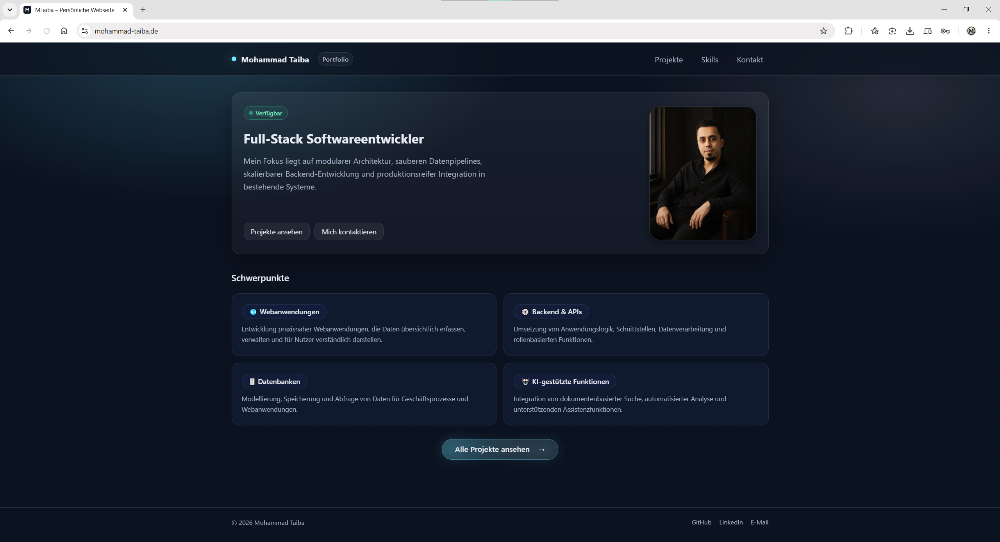
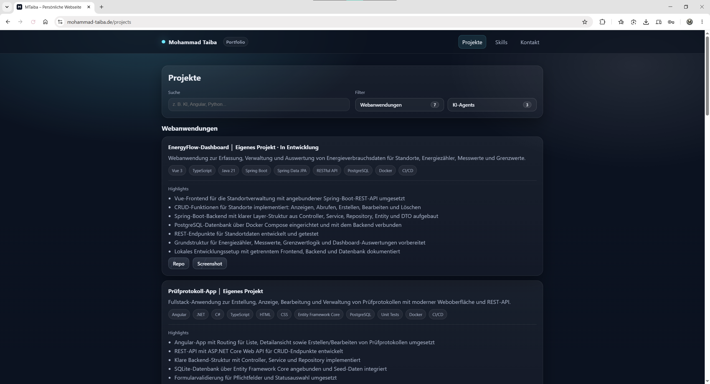
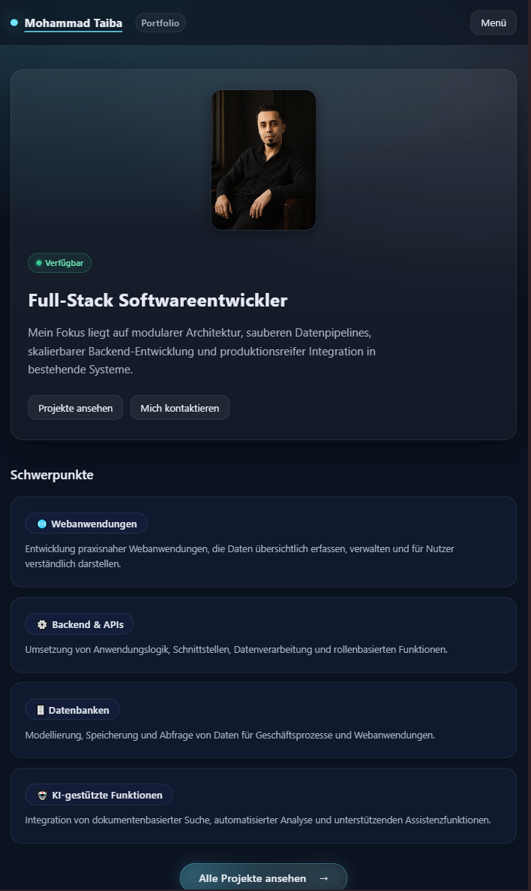

# Portfolio

[](https://github.com/mohammadtaiba/portfolio/actions/workflows/code-quality.yml)
[](https://angular.dev/)
[](https://www.cloudflare.com/)
[](#lizenz)

Persönliche Portfolio-Webseite zur Präsentation meiner Projekte, technischen Schwerpunkte und Kontaktmöglichkeiten. Die Anwendung ist als moderne Angular 21 Single-Page-App mit Standalone Components, Lazy Loading und zentral gepflegten Inhaltsdaten umgesetzt.

## Inhaltsverzeichnis

- [Projektziel](#projektziel)
- [Highlights](#highlights)
- [Screenshots](#screenshots)
- [Tech Stack](#tech-stack)
- [Projektstruktur](#projektstruktur)
- [Lokale Entwicklung](#lokale-entwicklung)
- [Deployment](#deployment)
- [Hinweise zur Pflege](#hinweise-zur-pflege)
- [License](#License)

## Projektziel

Dieses Repository bildet mein persönliches Portfolio ab. Ziel ist eine klare, moderne und responsiv nutzbare Oberfläche, mit der Besucher schnell einen Überblick über meine Projekte, Skills und den Kontakt erhalten.

## Highlights

- Moderne Angular-21-SPA mit Standalone Components und file-based Routing
- Zentrale Datenhaltung in `src/app/data/portfolio-data.ts`
- Projektseite mit Suche, Kategorie-Filter und Lightbox für Screenshots, Videos und Architekturmaterial
- Klare Trennung von Navigation, Seiten und Shared UI über wiederverwendbare Komponenten
- Responsives Layout für Desktop und Smartphone
- Cloudflare-taugliche SPA-Redirects über `src/_redirects`
- GitHub-Actions-gestützte Qualitätsprüfungen

## Screenshots

### Startseite



Die Startseite bündelt Profil, Schwerpunkte und direkte Einstiege zu Projekten und Kontakt.

### Projekte



Die Projektseite enthält eine Suche nach Projektnamen, Technologien und Stichworten sowie Filter für Webanwendungen und KI-Agents.

### Responsive Ansicht



Die mobile Ansicht bleibt übersichtlich und nutzt die verfügbare Fläche effizient.

## Tech Stack

| Bereich | Technologie |
| --- | --- |
| Frontend | Angular 21, TypeScript, HTML, CSS |
| Architektur | Standalone Components, Angular Router, Lazy Loading |
| Styling | Globale Design-Tokens in `src/styles.css` |
| Tooling | Angular CLI, npm, ESLint, angular-eslint |
| Deployment | Cloudflare / SPA Redirects |
| CI/CD | GitHub Actions |

## Projektstruktur

```text
src/
  app/
    app.component.*
    app.routes.ts
    data/portfolio-data.ts
    pages/
    shared/section.component.ts
  assets/
    profile.png
    projects/
docs/
  screenshots/
```

## Lokale Entwicklung

### Voraussetzungen

- Node.js LTS
- npm

### Installation

```bash
git clone https://github.com/mohammadtaiba/portfolio.git
cd portfolio
npm install
```

### Starten

```bash
npm start
```

Die Anwendung läuft danach unter `http://localhost:4200`.

### Build

```bash
npm run build
```

### Linting

```bash
npm run lint
npm run lint:fix
```

### Tests

```bash
npm test
```

## Deployment

Für ein Hosting auf Cloudflare sind die SPA-Redirects bereits vorbereitet. Die Datei `src/_redirects` sorgt dafür, dass direkte Aufrufe auf Routen wie `/projects` korrekt auf `index.html` zurückgeführt werden.

## Hinweise zur Pflege

- Inhalte werden zentral in `src/app/data/portfolio-data.ts` gepflegt.
- Neue Seiten sollten als Standalone Pages umgesetzt und über `src/app/app.routes.ts` lazy geladen werden.
- Bei Routing-Änderungen immer die mobile Navigation und das Scroll-Verhalten mitprüfen.

## License

Copyright (c) 2026 Mohammad Taiba. All rights reserved.

This project is published for portfolio and review purposes only. See [LICENSE](./LICENSE).
